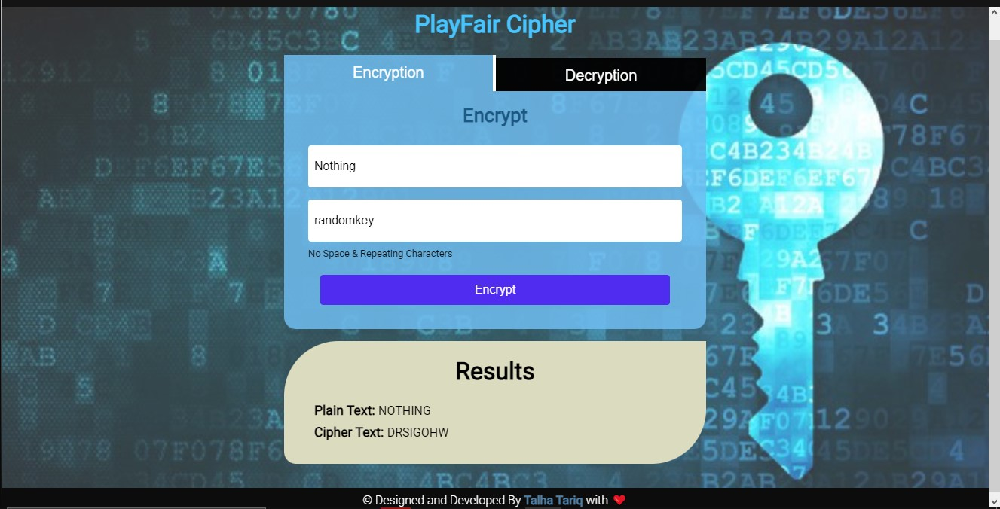

# Playfair Cipher
I developed the web based Playfair Cipher Algirthm for encryption as well as decryption of data using a key and some constraints. You can Encrypt or Decrypt Data by following the constraints of the Algorithm.  
[Click to see the Live Site](https://playfair-cipher-algo.netlify.app)
  

## Developed with 
- HTML & CSS
- JavaScript (ES6 + Modules)

## Features:
- You can perform Encryption or Decryption by switching to the Tabs.
- An elegant UI for easeness of user.
- Fully Responsive for all devices.

## Contributions are welcomed
If you wanna enhance this algorithm or found any bugs in it, your contributions are mostly welcomed.

Happy Learning!
